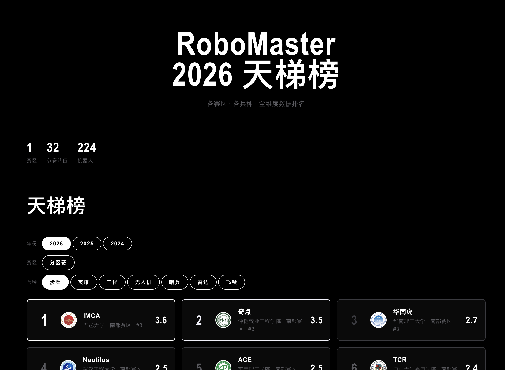
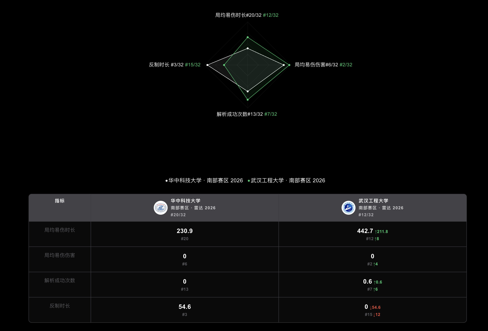
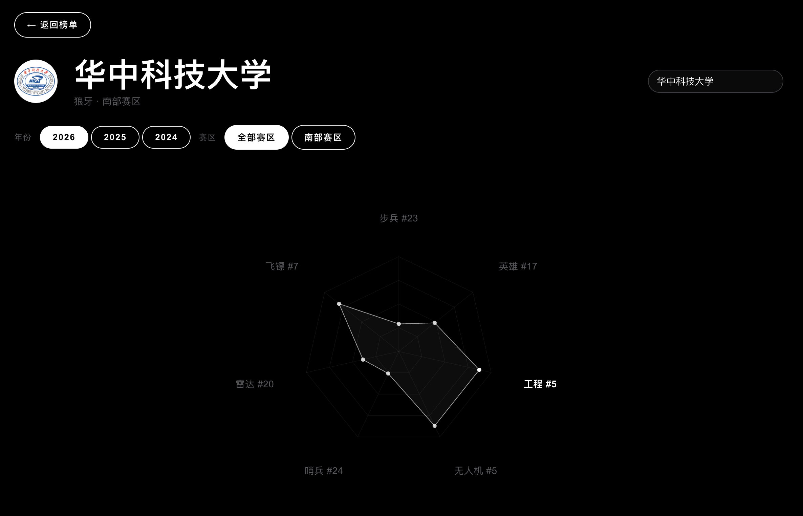
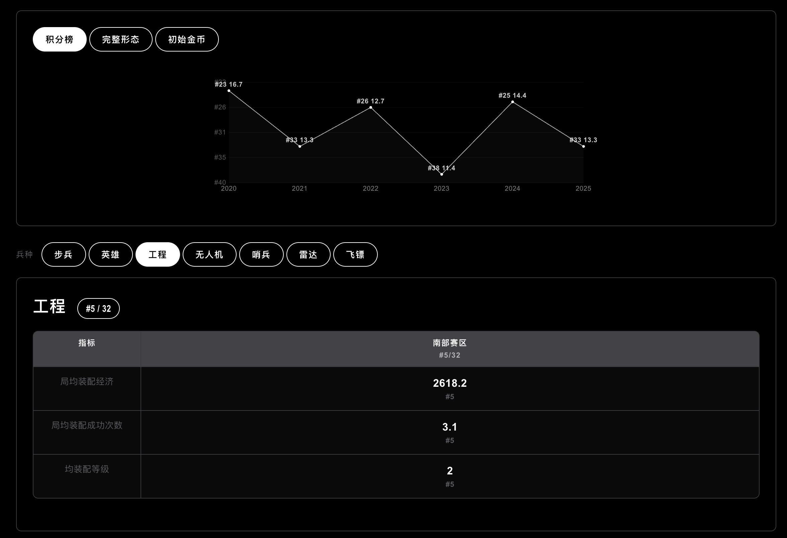
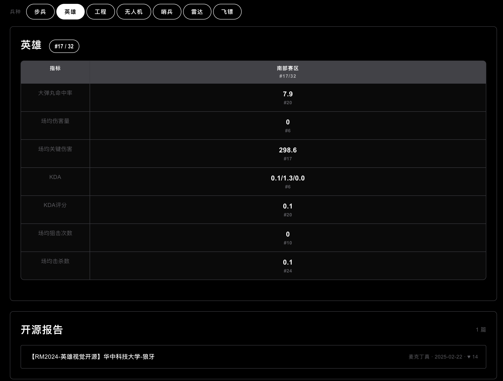

# RM Ladder — RoboMaster 天梯榜

RoboMaster 超级对抗赛数据可视化工具，单页应用，无需构建。

<!--  -->

## 功能

### 天梯排行

按兵种（步兵/英雄/工程/无人机/哨兵/雷达/飞镖）展示各战队数据排名，支持赛区筛选和年度切换。



### 战队对比

多战队并排对比，雷达图 + 数据表格。



### 战队详情

三种排名趋势切换展示：

 
 

 |


### 其他特性

- **论坛报告** — 自动抓取 RoboMaster BBS 上匹配战队+兵种的开源技术报告
- **年度切换** — 支持 2024、2025、2026 三个赛季数据

## 运行

纯静态项目，任意 HTTP 服务器即可：

```bash
python3 -m http.server 8000
```

然后打开 `http://localhost:8000`。

## 项目结构

```
├── index.html                        # 单文件 SPA（HTML + CSS + JS）
├── static/
│   ├── robot_data_2026.json          # 2026 赛季数据
│   ├── robot_data_2025.json          # 2025 赛季数据
│   ├── game_data_2024.json           # 2024 赛季数据
│   ├── score_history.json            # 积分榜历史（2020-2025）
│   ├── assessment_history.json       # 完整形态考核历史（2021-2026）
│   ├── goldcoin_history.json         # 初始金币历史（2022-2026）
│   ├── forum_reports_2026.json       # BBS 论坛技术报告
│   └── college_logos.json            # 高校 Logo URL 映射
├── logo/                             # 本地 Logo 文件
├── scripts/
│   ├── build_score_history.py        # 构建积分榜历史数据
│   ├── build_assessment_history.py   # 构建完整形态考核历史数据
│   ├── build_goldcoin_history.py     # 构建初始金币历史数据
│   └── fetch_forum_reports.py        # 抓取 BBS 论坛技术报告
└── .github/workflows/
    └── fetch-forum.yml               # 每周自动抓取论坛报告
```

## 数据更新

历史数据硬编码在 `scripts/` 下的 Python 脚本中。更新数据后重新生成 JSON：

```bash
python3 scripts/build_score_history.py
python3 scripts/build_assessment_history.py
python3 scripts/build_goldcoin_history.py
```

论坛报告通过 GitHub Actions 每周自动抓取，也可手动运行：

```bash
pip install requests
python3 scripts/fetch_forum_reports.py
```

## 设计

SpaceX 风格：纯黑画布、D-DIN 字体、ghost pill 按钮、大写展示文字。详见 [DESIGN.md](DESIGN.md)。

